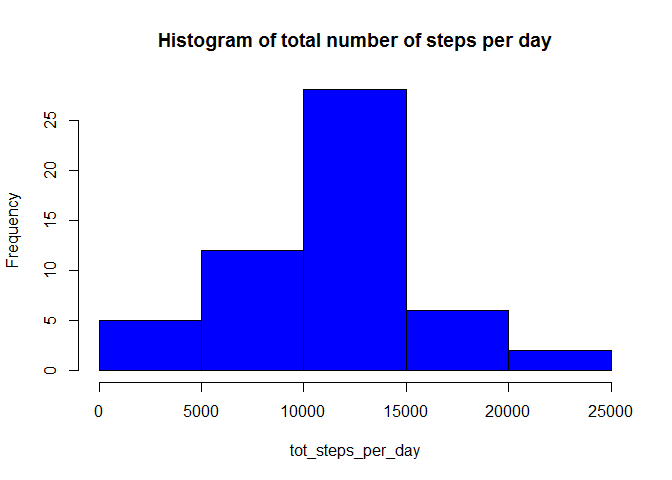
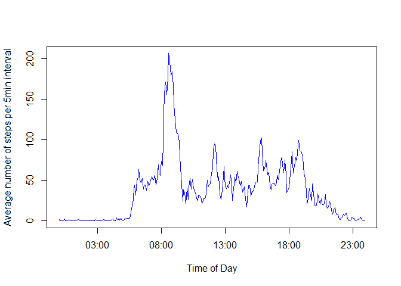
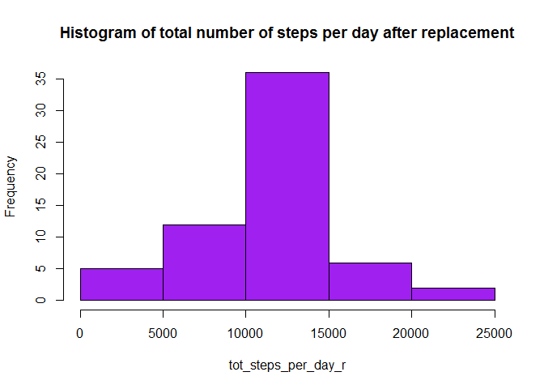
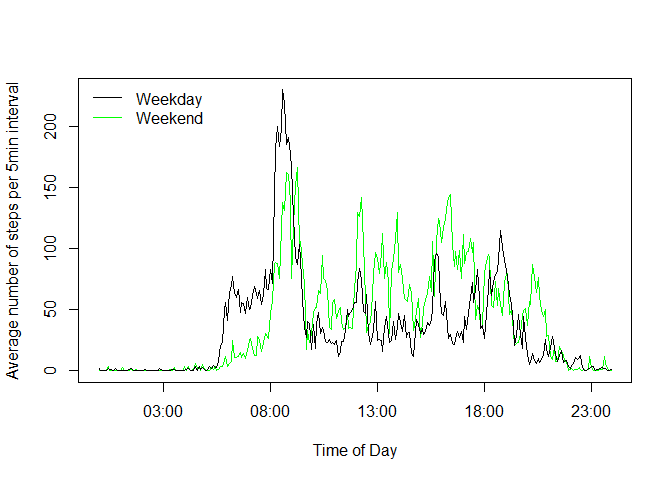

# Reproducible Research: Peer Assessment 1


## Loading and preprocessing the data

```r
Sys.setlocale("LC_TIME", "English")
```

```
## [1] "English_United States.1252"
```

```r
setwd("C:/Users/Steph/Documents/Coursera_Data_science/Course5_Reproducible_Research/Assignment1")
unzip("activity.zip")
data<-read.csv("activity.csv",header=TRUE,na.strings = "NA")
data$date<-as.Date(data$date,"%Y-%m-%d")
library(lubridate)
data$interval<-formatC(data$interval,width=4,format="d",flag="0")
data$time<-strptime(paste(data$date,data$interval,sep=","), format="%Y-%m-%d,%H%M")
data$interval1<-format(data$time,'%H:%M')
```

## What is mean total number of steps taken per day?


```r
data1=data[!is.na(data$steps),]
tot_steps_per_day<-tapply(data1$steps,data1$date,sum)
```

Here is the histogram of the total number of steps per day:

```r
hist(tot_steps_per_day, main="Histogram of total number of steps per day",col="blue")
```

 

Finally, let's calculate the mean and median of the total number of steps per day:

```r
mean_tot_steps_per_day<-mean(tot_steps_per_day)
median_tot_steps_per_day<-median(tot_steps_per_day)
```

The mean and median of the total number of steps taken per day are 1.0766189\times 10^{4} and 10765, respectively.


## What is the average daily activity pattern?


```r
av_nb_steps_per_interval<-tapply(data1$steps,data1$interval1,mean)
time_of_day<-strptime(names(av_nb_steps_per_interval), format="%H:%M")
plot(time_of_day,av_nb_steps_per_interval,type="l",xlab="Time of Day",ylab="Average number of steps per 5min interval", col="blue")
```

 

```r
max_act<-data1$interval1[which(av_nb_steps_per_interval==max(av_nb_steps_per_interval))]
```

The 5-minute interval that contains, on average the maximum number of steps starts at 08:35.

## Imputing missing values

Calculate and report the total number of missing values in the dataset (i.e. the total number of rows with NAs)

```r
nb_missing<-length(which(is.na(data$steps)))
```

There are 2304 missing  values in the dataset.


I decided to replace the missing values in the dataset by the mean for that 5-minute interval.

The new dataset that is equal to the original dataset but with the missing data filled in is called data2 and created as follow:


```r
data2<-data
for (i in 1:dim(data2)[1])
  {
  if(is.na(data2$steps[i])){data2$steps[i]<-av_nb_steps_per_interval[which(names(av_nb_steps_per_interval)==data2$interval1[i])]}
  }
```

 Do these values differ from the estimates from the first part of the assignment? What is the impact of imputing missing data on the estimates of the total daily number of steps?

Calculate, after replacement of missing values, the total number of steps taken each day


```r
tot_steps_per_day_r<-tapply(data2$steps,data2$date,sum)
```

Here is the histogram of the total number of steps per day:

```r
hist(tot_steps_per_day_r, main="Histogram of total number of steps per day after replacement",col="purple")
```

 

Finally, let's calculate the mean and median of the total number of steps per day:

```r
mean_tot_steps_per_day_r<-mean(tot_steps_per_day_r)
median_tot_steps_per_day_r<-median(tot_steps_per_day_r)
```

The mean and median of the total number of steps taken per day after replacement are 1.0766189\times 10^{4} and 1.0766189\times 10^{4}, respectively, which is very close to the values before replacement. This is because the missing values have been replaced by the means, so the values keep close to that after replacement.

## Are there differences in activity patterns between weekdays and weekends?

```r
data2$weekday<-as.factor(format(data2$date,'%a'))
levels(data2$weekday)<-c("weekdays","weekdays","weekend","weekend","weekdays","weekdays","weekdays")

library(plyr)
```

```
## 
## Attaching package: 'plyr'
## 
## The following object is masked from 'package:lubridate':
## 
##     here
```

```r
act_diff<-ddply(data2,c("weekday","interval1"),summarize, av_steps=mean(steps))
act_diff$interval2<-strptime(act_diff$interval1, format="%H:%M")
yrange<-range(act_diff$av_steps)
plot(act_diff$interval2[which(act_diff$weekday==c("weekend"))],act_diff$av_steps[which(act_diff$weekday==c("weekend"))],type="l",xlab="Time of Day",ylab="Average number of steps per 5min interval", col="green",ylim=yrange)
lines(act_diff$interval2[which(act_diff$weekday==c("weekdays"))],act_diff$av_steps[which(act_diff$weekday==c("weekdays"))],col="black")
legend("topleft",c("Weekday","Weekend"),lty=1,col=c("black","green"),bty = "n")
```

 

In the weekend, the walking is delayed in the day, as people sleep in, and they tend to walk the most during the afternoon.
